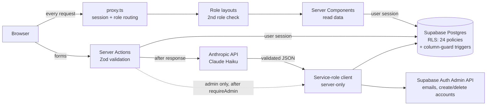

# WealthAdvisor

A web app for wealth advisory firms. Advisors keep each client's assets, income and private notes in one file and generate an AI-assisted allocation; clients follow their portfolio and the latest recommendation from their own read-only portal; an administrator manages accounts, roles and advisor assignments.

Built for the AiLaB intern assignment (full-stack AI web application).

**Live app:** https://YOUR-APP.vercel.app
Demo accounts for each role are shared separately with reviewers.

---

## Features by role

| Role | What they can do |
|---|---|
| **Admin** | Create and delete accounts, change roles, assign each client to an advisor. Sees account data only, never financial data. |
| **Advisor** | Sees only the clients assigned to them. Full CRUD on their clients' assets and income, edits age and risk tolerance, keeps private notes, generates and archives AI recommendations. |
| **Client** | Read-only portal: their own assets, income, profile and the recommendations their advisor shared (status `done` only). Never sees notes. |

New sign-ups always start as **client**; only an admin can change a role.

## Tech stack and why

| Technology | Why |
|---|---|
| **Next.js 16 (App Router)** | Front end and back end in one project; Server Components read data on the server, Server Actions handle mutations without a separate API layer. |
| **Supabase (PostgreSQL + Auth)** | Managed Postgres with authentication included. Row Level Security enforces permissions inside the database, so a bug in the UI cannot leak another advisor's clients. |
| **Anthropic API (Claude Haiku)** | Generates the allocation and explanation as strict JSON; fast and inexpensive for short structured outputs. |
| **Tailwind CSS** | Utility classes plus a small set of design tokens; responsive layouts from mobile to desktop. |
| **Zod** | One schema per entity, used by forms, Server Actions and to validate the model's output. |
| **Vercel** | Native Next.js hosting, automatic deploys on every push to `main`. |

## Architecture



Access control works in three layers:
1. **`proxy.ts`** (Next.js 16 name for `middleware.ts`): checks the session on every request and sends each role to its own area (`/admin/users`, `/clients`, `/portal`).
2. **Role layouts**: each route group re-checks the role on the server.
3. **Row Level Security** in Postgres: the final guarantee. Every policy is `TO authenticated` and carries its own role test.

The service-role key, which bypasses RLS, lives only in `lib/supabase/admin.ts` (marked `server-only`) and is used for exactly three jobs, each with its own check: finishing an AI recommendation (only the row this request created), admin account creation/deletion, and the admin email lookup (both behind `requireAdmin()`).

## Roles and permissions

| Table | Admin | Advisor | Client |
|---|---|---|---|
| `users` | read all, update role / advisor / name | read self + assigned clients, update own name and clients' age / risk | read and update own name |
| `assets`, `income` | none | full CRUD on assigned clients | read own |
| `recommendations` | none | read and create for assigned clients, archive `done` ones | read own, `done` only |
| `notes` | none | full CRUD on own notes about assigned clients | none |

Column rules RLS cannot express are enforced by the `guard_user_cols` trigger (only an admin changes `role` / `advisor_id`, only the assigned advisor changes `age` / `risk_tolerance`) and the `guard_reco_update` trigger (users can only move a recommendation from `done` to `archived`).

## Data model

Five tables: `users` (linked to `auth.users`), `assets`, `income`, `recommendations`, `notes`, with native enums `user_role`, `risk_level` and `reco_status`. Full definitions, delete rules and indexes are in [`supabase/migrations`](supabase/migrations).

## AI recommendation

1. The advisor clicks **Generate**. The server checks that age and at least one asset or income line exist, then inserts a `generating` row with the advisor's session (RLS applies).
2. The response returns immediately; the model call continues in `after()`. The page polls until the status changes.
3. The model receives age, risk tolerance, holdings and previous allocations, never the client's name.
4. Its output must match the Zod contract (three integers summing to 100, explanation of at most 4,000 characters, disclaimer). Valid output sets the row to `done`; anything else sets it to `failed`.
5. The prompt forbids definitive advice and named securities; every view shows that the result is an indicative simulation, not regulated advice.

## Project structure

```
proxy.ts                     session + role routing (formerly middleware.ts)
app/
  (auth)/login, signup       public pages
  (admin)/admin/users        admin area
  (advisor)/clients, [id]    advisor area
  (client)/portal            client area
actions/                     Server Actions (assets, income, notes, clients, recommendations, admin)
components/                  UI components and page views
lib/
  supabase/                  browser, server and service-role clients
  auth/                      current user, requireRole, requireAdmin
  ai/recommend.ts            model call and output validation
  validation/schemas.ts      shared Zod schemas
supabase/
  migrations/                0001 schema, 0002 functions and triggers, 0003 RLS policies
  tests/rls_test.sql         18 role-by-role security checks
```

## Getting started

Prerequisites: Node.js 20+, a Supabase project, an Anthropic API key.

```bash
git clone https://github.com/yga95/wealthadvisor.git
cd wealthadvisor
npm install
cp .env.example .env.local   # then fill in your values
```

1. In the Supabase **SQL Editor**, run the three files in `supabase/migrations` in order.
2. Create accounts (sign up in the app or via **Authentication → Users**), then promote the first admin from the SQL Editor:
   ```sql
   update public.users set role = 'admin'
   where id = (select id from auth.users where email = 'you@example.com');
   ```
3. Start the app:
   ```bash
   npm run dev
   ```
   Open http://localhost:3000.

### Security tests

`supabase/tests/rls_test.sql` impersonates each role and checks 18 cases (an advisor cannot see or write another advisor's client, a client cannot promote themselves, the admin sees no financial data…). Run it in the SQL Editor after creating the test accounts; every row should show ✅.

## Deployment

Deployed on Vercel from the `main` branch. The four variables from `.env.example` are set in **Vercel → Project → Settings → Environment Variables**, and the Vercel URL is set as the Site URL in **Supabase → Authentication → URL Configuration**.

## Differences from the Phase 2 design

- `middleware.ts` is named `proxy.ts`: Next.js 16 renamed the file convention; behaviour is the same.
- Recommendation generation is a Server Action (`actions/recommendations.ts`) rather than a Route Handler; it performs the same checks and uses `after()` for the asynchronous model call.
- Not implemented yet: the shared `/profile` page and pagination of long lists.
